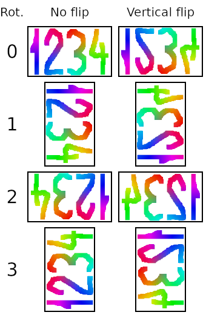

# Rotation sample

All possible rotations of an image are shown here, displaying how to achieve any desired rotation or reflection using
the [`plum_rotate_image`][rotate] function.

The first column shows different values for the `count` parameter.
The second and third columns contain the same sample image rotated that many times, with or without vertical flipping
(i.e., with a zero or non-zero value of `flip`, respectively).

* * *

Up: [`plum_rotate_image`][rotate]

[rotate]: functions.md#plum_rotate_image
